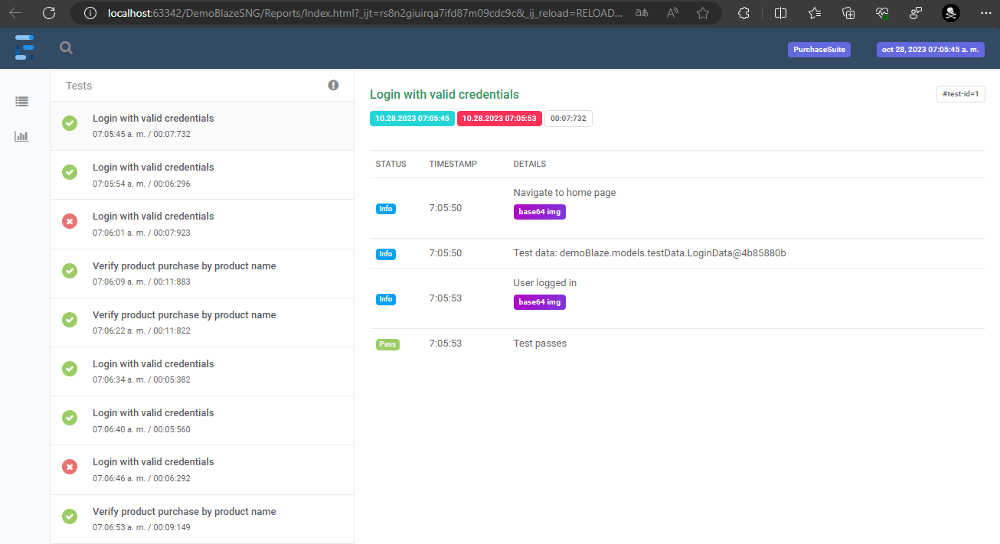

# DemoBlaze Automation with Selenium
This project was made for automating tests in [DemoBlaze](https://www.demoblaze.com/) implementing Java + Selenium + TestNg + Extent Reports with the use of screenplay pattern. 

## Supported Browsers
Currently, it supports chrome and firefox browsers. Both web drivers are located on **resources** folder.
* Full regression suite will test all test cases in both browsers.

## About Reporting
It creates a report inside the folder [**Report**](/Reports) listing all the test cases executed and it also takes screenshots during the testing processes.



## Test Cases
Currently test cases created are listed below:
* TC-1 Check product purchase by name. 
* TC-2 Check login with valid credentials.

## Test Cases Data
Data can be modified at [**resources/testdata/login**](resources/testdata)

* valid login data (Third case must fail as password is wrong)
``` json
  [
  {
  "username": "1234",
  "password": "1234"
  },
  {
  "username": "demoblaze",
  "password": "demoblaze"
  },
  {
  "username": "demoblaze",
  "password": "demoblazer"
  }
  ]
```

* purchase product data
``` json
[
  {
    "category": "Laptops",
    "productName": "MacBook air"
  },
  {
    "category": "Monitors",
    "productName": "ASUS Full HD"
  }
]
```

* Order Data can be found and modified at [OrderData](src/main/java/demoBlaze/models)
```java
public class OrderData {
    private String name = "Wilfor";
    private String country = "Bolivia";
    private String city = "La Paz";
    private String card = "12345";
    private String month = "7";
    private String year = "2023";
}
```
